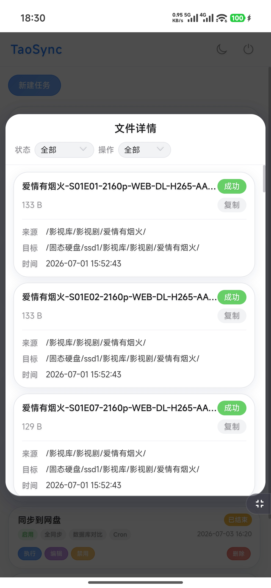
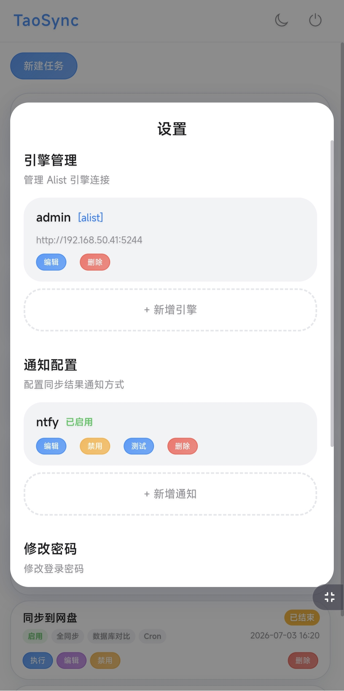
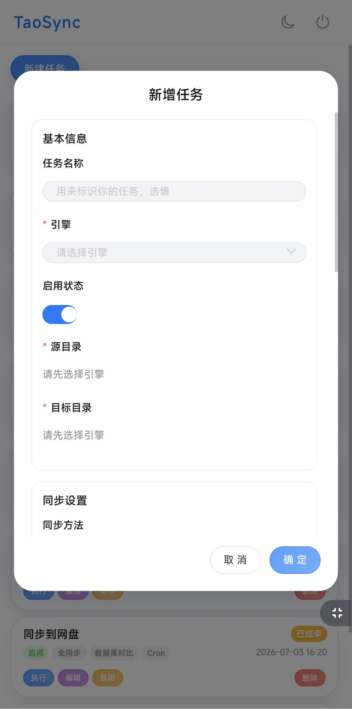
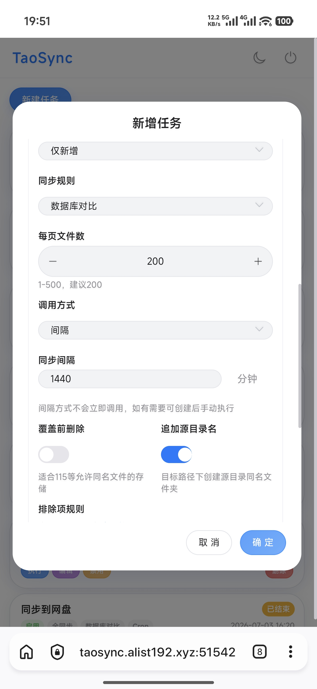

<h1 align="center">taosync-new</h1>
<p align="center">
  <em>TaoSync-new是一个适用于OpenList/AList的自动化同步工具（重构版）。</em>
</p>
<p align="center">
  <a href="https://github.com/wuanqicll-del/taosync-new"></a>
  <a href="https://hub.docker.com/r/wuanqicll/taosync-new"></a>
</p>

---

本项目基于 [dr34m-cn/taosync](https://github.com/dr34m-cn/taosync) 进行了大幅重构和新增功能，欢迎提交bug或者建议

**如果好用，请 Star！非常感谢！** [GitHub](https://github.com/wuanqicll-del/taosync-new) · [DockerHub](https://hub.docker.com/r/wuanqicll/taosync-new)

---

<details>
<summary><strong>点击展开截图</strong></summary>

<p align="center">
  
</p>

<p align="center">
  
</p>

<p align="center">
  
</p>

<p align="center">
  
</p>

</details>

---

## 改进内容

相比原项目，本版本主要改进：

**前端重构**

- 整个前端页面全部重构，简洁的同时保留各种进度细节

- 对移动端网页进行完全适配，移动端浏览器使用更友好

**功能增强**

- 更稳定的同步引擎，采用先扫描后执行模式

- 更好的错误处理和重试机制

- 更灵活的过滤规则

- 支持三种同步规则：数据库对比、大小+名称、大小+名称+时间
  - 数据库对比完全不扫描目标目录，只会根据源目录对比数据库缓存数据，优点是对比非常快，而且对变化感知更精准，且不会触发某些网盘风控问题，缺点是目标目录如果删除或者新增了文件，源目录并不知道，可以采取日常用数据库对比，偶尔用大小+名称或者+时间执行一次
  
- 针对115网盘特性，增加了个覆盖前删除选项，115会允许同名文件同时存在，当同样文件源目录变了，会同步上去变成新旧文件同时存在，此选项开启后会在同步前先删除目标目录的对应文件再同步

- 增加分页大小设置，解决原项目如果某目录下文件过多会造成只扫到部分的问题，此项默认就行，增加了循环分页，不会出现问题

- 增加cron表达式输入后预览具体执行时间

- 支持设置多源目录多目标目录

- 增加追加源目录名功能，例如源目录为（/固态硬盘/docker/）开启后会直接把docker这个文件夹包括里面的内容都同步过去，关闭则只同步docker文件夹下的内容

- 支持多种通知方式：自定义、Server酱、钉钉、企业微信、Lark等

---

## 特性

- 开源免费，接受任意审查
- [Github Actions](https://docs.github.com/zh/actions) 自动打包与发布，过程公开透明
- 支持 Docker，下载即用（支持 AMD64 和 ARM64 架构）
- 干净卸载，不用的时候删掉即可，无任何残留
- 密码加密不可逆，永远不会泄露您的密码
- 完全离线运行（仅连接 AList），永不上传用户隐私
- 完善的错误处理，稳定可靠
- 完善的日志，所有错误都会被记录
- 引擎管理，可以自由增删改查 `OpenList/AList`
- 任务管理，可以新增/删除/启用/禁用/编辑/手动执行任务
- 支持排除项规则，可以排除指定目录或文件不同步
- 仅新增、全同步、移动三种模式
- 支持三种同步规则：数据库对比、大小+名称、大小+名称+时间
- 定时同步支持间隔、`cron`、手动调用
- 同步进度分阶段实时显示
- 存储可控，合理配置任务记录与日志保留天数
- 支持通知功能，可在任务成功或失败后发送通知（支持自定义、Server酱、钉钉、企业微信、Lark等）

---

## 使用方法

### Docker 部署（推荐）

```bash
# 创建数据目录（用于持久化数据库和配置）
mkdir -p /path/to/data

# 运行容器
docker run -d \
  --name taosync \          # 容器名称
  -p 8023:8023 \            # 端口映射：宿主机端口:容器端口
  -v /path/to/data:/app/data \  # 数据卷挂载：宿主机目录:容器目录
  --restart unless-stopped \    # 重启策略：除非手动停止，否则总是重启
  wuanqicll/taosync-new:latest  # 镜像名称:标签
```

### Docker Compose 部署

创建 `docker-compose.yml`：

```yaml
services:
  taosync:
    image: wuanqicll/taosync-new:latest  # 镜像名称:标签
    container_name: taosync-new          # 容器名称
    restart: always                      # 重启策略：总是重启
    network_mode: "bridge"               # 网络模式：桥接模式
    environment:
      - TZ=Asia/Shanghai                 # 时区设置：亚洲/上海
    ports:
      - "8023:8023"                      # 端口映射：宿主机端口:容器端口
    volumes:
      - ./data:/app/data                 # 数据卷挂载：宿主机目录:容器目录（数据本地化）
```

启动服务：

```bash
docker-compose up -d
```

### 访问 WebUI

打开浏览器访问：`http://你的IP:8023`

**默认登录信息：**
- 用户名：`admin`
- 密码：随机生成（首次启动时在日志中输出，请查看容器日志获取密码）

**查看密码命令：**

```bash
# Docker
docker logs taosync 2>&1 | grep "Password for admin"

# Docker Compose
docker-compose logs 2>&1 | grep "Password for admin"
```

登录后请立即前往系统设置修改密码。

---

## 配置项

配置优先级：`data/config.ini` > `环境变量` > `默认值`

`data/config.ini` 文件示例：

```ini
[tao]
# 运行端口号
port=8023
# 登录有效期，单位天
expires=2
# 日志等级：0-DEBUG，1-INFO，2-WARNING，3-ERROR，4-CRITICAL
log_level=1
# 控制台日志等级
console_level=2
# 系统日志保留天数，0表示不自动清理
log_save=7
# 任务记录保留天数，0表示不自动清理
task_save=0
# 任务执行超时时间，单位小时
task_timeout=72
```

| config.ini | Docker 环境变量 | 描述 | 默认值 |
| :--- | :--- | :--- | :--- |
| port | TAO_PORT | 运行端口号 | 8023 |
| expires | TAO_EXPIRES | 登录有效期，单位天 | 2 |
| log_level | TAO_LOG_LEVEL | 日志等级：0-DEBUG，1-INFO，2-WARNING，3-ERROR，4-CRITICAL | 1 |
| console_level | TAO_CONSOLE_LEVEL | 控制台日志等级 | 2 |
| log_save | TAO_LOG_SAVE | 系统日志保留天数，0 表示不自动清理 | 7 |
| task_save | TAO_TASK_SAVE | 任务记录保留天数，0 表示不自动清理 | 0 |
| task_timeout | TAO_TASK_TIMEOUT | 任务执行超时时间，单位小时 | 72 |
| - | TZ | 时区 | Asia/Shanghai |

---

## 常见问题

**1. 如何更新版本？**

```bash
# 拉取最新镜像
docker pull wuanqicll/taosync-new:latest

# 重启容器
docker-compose down
docker-compose up -d
```

**2. 如何备份数据？**

数据存储在 `/app/data` 目录下的 SQLite 数据库中，备份该目录即可。

**3. 忘记密码怎么办？**

删除 `data/` 目录下的数据库文件，重启服务会重新生成随机密码（查看容器日志获取新密码）。

---

## 许可证

MIT License

---
## 须知

> [!IMPORTANT]
> 使用本工具前你必须了解并且会使用openlist或alsit；本工具没有集成，你需要额外部署。


## 致谢

- 原项目：[dr34m-cn/taosync](https://github.com/dr34m-cn/taosync)
- 感谢原作者 [dr34m](https://github.com/dr34m-cn) 的优秀工作

---

## 项目地址

- GitHub：https://github.com/wuanqicll-del/taosync-new
- DockerHub：https://hub.docker.com/r/wuanqicll/taosync-new
